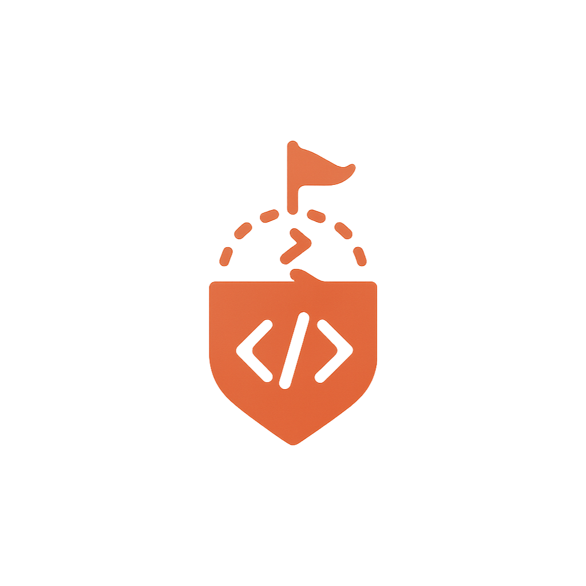

# CodeQuest 🚀
<div align="center">
  
</div>

<div align="center">

  

[](https://opensource.org/licenses/MIT)
[](https://github.com/codequest-team/codequest)
[](https://spring.io/projects/spring-boot)
[](https://github.com/codequest-team/codequest)

</div>  

> **Plataforma educativa gamificada que transforma el aprendizaje de programación en oportunidades laborales reales**

## 📋 Tabla de Contenidos

- [Descripción del Proyecto](#-descripción-del-proyecto)
- [Características Principales](#-características-principales)
- [Tecnologías](#-tecnologías)
- [Instalación y Configuración](#-instalación-y-configuración)
- [Estructura del Proyecto](#-estructura-del-proyecto)
- [Páginas del Sitio Web](#-páginas-del-sitio-web)
- [Equipo de Desarrollo](#-equipo-de-desarrollo)
- [Gamificación](#-gamificación)
- [Contribución](#-contribución)
- [Licencia](#-licencia)

## 🎯 Descripción del Proyecto

CodeQuest es una plataforma educativa integral que combina **aprendizaje adaptativo**, **gamificación** y **herramientas de empleabilidad** para transformar a estudiantes en desarrolladores altamente empleables. 

### Propuesta de Valor Única (UVP)
*"Aprende, demuestra y consigue trabajo: una sola plataforma que transforma el conocimiento en candidaturas válidas y perfiles laborales competitivos."*

### Problema que Resolvemos
- Baja retención en métodos tradicionales de enseñanza
- Desconexión entre habilidades enseñadas y demandas del mercado
- Ansiedad y falta de preparación en entrevistas técnicas
- Dificultad para demostrar skills reales a empleadores

### Nuestra Solución
- **Aprendizaje Visual e Interactivo**: Videos generados por IA, mapas mentales, diagramas visuales
- **Gamificación Integral**: Sistema de niveles, streaks, badges verificables, CodeCoins
- **Empleabilidad Real**: Simulador de entrevistas con IA, optimización de CV, conexión directa con empleadores
- **Personalización por IA**: Rutas adaptativas, ejercicios generados automáticamente, feedback contextual

## ✨ Características Principales

### 🎮 Sistema de Gamificación
- **5 Niveles Profesionales**: Code Apprentice → Code Explorer → Code Builder → Code Craftsman → Code Master
- **Sistema de Streaks**: Rachas diarias que multiplican XP y desbloquean contenido
- **Badges Verificables**: Micro-certificaciones exportables a LinkedIn y GitHub
- **CodeCoins**: Moneda virtual para desbloquear contenido premium
- **Leaderboards**: Competencias por cohorte, especialidad y progreso semanal

### 🤖 Inteligencia Artificial
- Generación automática de ejercicios personalizados
- Análisis vocal y textual para simulaciones de entrevistas
- Feedback contextual y adaptativo
- Match Score vs ofertas laborales reales

### 💼 Herramientas de Empleabilidad
- Simulador de entrevistas técnicas y comportamentales
- Conversión automática de logros a métricas cuantificables
- Panel de empleabilidad con conexiones directas

## 🛠 Tecnologías 
###(Sitio Web de Preseetación)

### Backend
- **Java 21** - Lenguaje principal
- **Spring Boot 2.7.0** - Framework web
- **Maven** - Gestión de dependencias

### Frontend
- **Thymeleaf** - Motor de plantillas
- **HTML5, CSS3, JavaScript** - Tecnologías web base
- **Font Awesome** - Iconografía
- **Google Fonts (Inter)** - Tipografía


### DevOps y Deployment
- **Docker** - Contenedorización
- **GitHub Actions** - CI/CD
- **AWS/Heroku** - Deployment (configuración pendiente)

## 🚀 Instalación y Configuración

### Prerrequisitos
- Java 21 o superior
- Maven 3.6+
- Git

### Instalación Local

1. **Clonar el repositorio**
```bash
git clone https://github.com/codequest-team/codequest.git
cd codequest
```

2. **Instalar dependencias y ejecutar**
```bash
mvn clean install
mvn spring-boot:run
```

3. **Acceder a la aplicación**
```
http://localhost:8091
```

### Configuración de Desarrollo
- **Puerto por defecto**: `8091`
- **Hot reload**: Habilitado con Spring Boot DevTools

## 📁 Estructura del Proyecto 
### (LandingPage)

```
codequest/
├── src/
│   ├── main/
│   │   ├── java/com/codequest/
│   │   │   ├── controller/          # Controladores  Web
│   │   │   ├── service/             # Lógica de negocio
│   │   │   ├── repository/          # Acceso a datos (JPA)
│   │   │   ├── model/               # Entidades y DTOs
│   │   │   ├── config/              # Configuraciones
│   │   │   ├── Utils/               # Servicios adicionales( Envio de correos, etc)
│   │   │   └── CodeQuestApplication.java
│   │   └── resources/
│   │       ├── static/
│   │       │   ├── STYLES/          # Archivos CSS
│   │       │   ├── SCRIPT/          # Archivos JavaScript
│   │       │   └── IMAGES/          # Recursos gráficos
│   │       ├── templates/           # Plantillas Thymeleaf
│   │       └── application.properties
│   └── test/                        # Tests unitarios e integración
├── .github/workflows/               # GitHub Actions
├── pom.xml                          # Configuración Maven
├── README.md
└── LICENSE
```

## 🌐 Páginas del Sitio Web

### 1. **Página Principal** (`/`)
- **Archivo**: `index.html`
- **Propósito**: Landing page principal con hero section, características y CTA
- **Componentes**:
  - Hero section con animaciones
  - Tarjetas de beneficios de programación
  - Sección de características destacadas
  - Estadísticas de la plataforma
  - Sección de invitación final con gamificación

### 2. **Nosotros** (`/nosotros`)
- **Archivo**: `nosotros.html`
- **Propósito**: Presentación del equipo y filosofía de CodeQuest
- **Componentes**:
  - Hero section del equipo
  - Perfiles detallados de los 5 miembros del equipo
  - Sección de experiencia y logros
  - Misión, visión y valores de la empresa
  - CTA para unirse a la comunidad

### 3. **Nuestra Solución** (`/codeQuest`)
- **Archivo**: `solucion.html`
- **Propósito**: Explicación detallada de la propuesta de valor y metodología
- **Componentes**:
  - UVP (Unique Value Proposition) destacada
  - Sistema de gamificación completo
  - Metodología visual y práctica
  - CodeQuest Journey (5 niveles)
  - Resolución de pain points específicos

### 4. **Contacto** (`/contacto`)
- **Archivo**: `contacto.html`
- **Propósito**: Formulario de contacto y información de la empresa
- **Componentes**:
  - Formulario de contacto interactivo
  - Información de contacto
  - Enlaces a redes sociales

### 5. **Fragmentos Reutilizables**
- **Archivo**: `fragmentos.html`
- **Propósito**: Header y footer reutilizables en todas las páginas
- **Componentes**:
  - Header con navegación y logo
  - Footer completo con enlaces, social media y newsletter

### Estilos CSS Modulares
- **`fragmentos.css`**: Estilos para header y footer
- **`index.css`**: Estilos específicos de la página principal (landing page)
- **`colores.css`**: Variables CSS con paleta de colores
- **`botonPrincipal.css`**: Estilos para botones CTA
- **`seccionLanding.css`**: Estilos para secciones de invitación
- **`nosotros.css`**: Estilos para la pagina de nosotros.html
- **`codeQuest.css`**: Estilos para la pagina de codeQuest.html

## 👥 Equipo de Desarrollo

### 🏢 Estructura Organizacional

| Nombre | Rol | Responsabilidades | Email | Especialidades |
|--------|-----|-------------------|-------|----------------|
| **Santiago Castro Garzón** | CEO / Director Ejecutivo | Visión estratégica, toma de decisiones, gestión general | sa-castro@javeriana.edu.co | Liderazgo, Planificación Estratégica, Comunicación |
| **Santiago Ávila** | CTO / Director de Tecnología | Desarrollo de productos, infraestructura técnica | - | Programación, Arquitectura de Sistemas, Gestión Técnica |
| **José Eduardo Valeriano Castiblanco** | CMO / Director de Marketing | Estrategia de marca, adquisición de clientes | josevaleriano@javeriana.edu.co | Marketing Digital, Análisis de Mercado, Creatividad |
| **Carol Fernanda Ríos** | CFO / Director Financiero | Gestión financiera, presupuestos, inversiones | rios_carolf@javeriana.edu.co | Contabilidad, Finanzas, Análisis Económico |
| **Xiomara Herrera Suárez** | COO / Director de Operaciones | Procesos internos, logística, recursos humanos | x_herrera@javeriana.edu.co | Organización, Eficiencia Operativa, Gestión de Equipos |

### 🎓 Institución Educativa
**Universidad Pontificia Javeriana** - Ingeniería de Sistemas y Computación

## 🎮 Gamificación

### Sistema de Niveles
1. **Code Apprentice** (0-500 XP) - Fundamentos y primeros pasos
2. **Code Explorer** (500-1,500 XP) - Exploración de tecnologías
3. **Code Builder** (1,500-3,000 XP) - Construcción de proyectos
4. **Code Craftsman** (3,000-5,000 XP) - Maestría técnica
5. **Code Master** (5,000+ XP) - Listo para el mercado laboral

### Sistema de Recompensas
- **Experience Points (XP)**: 10-100 XP por actividad
- **Streak Multipliers**: Hasta x10 XP por rachas consecutivas
- **CodeCoins**: Moneda virtual para contenido premium
- **Badges Verificables**: Micro-certificaciones exportables
- **Match Score**: Compatibilidad con ofertas laborales

### Mecánicas Principales
- **Daily Streaks**: El motor principal de engagement
- **Weekly Challenges**: Desafíos temáticos con recompensas especiales
- **Leaderboards**: Competencias por cohorte y especialidad
- **Achievement System**: Logros desbloqueables por hitos específicos


## 🤝 Contribución

### Proceso de Contribución
1. Fork del repositorio
2. Crear rama feature (`git checkout -b feature/SIGLASNOMBRE_nueva-caracteristica`)
3. Commit de cambios (`git commit -m 'Agregar nueva característica'`)
4. Push a la rama (`git push origin feature/SIGLASNOMBRE_nueva-caracteristica`)
5. Crear Pull Request (Aparece en Github en la rama main a menos que el cambio venga de una rama que ya se hizo pull request de hace menos de una hora)


## 📊 Métricas y KPIs

### Engagement
- **Daily Active Users (DAU)**
- **Retention Rate**: D1, D7, D30
- **Streak Maintenance**: % usuarios con streaks 7+ días
- **Time on Platform**: Minutos promedio por sesión

### Educación
- **Course Completion Rate**: % completación de rutas
- **Exercise Success Rate**: % ejercicios resueltos correctamente
- **Skill Progress**: Tiempo promedio para dominar skills

### Empleabilidad
- **Interview Success Rate**: % entrevistas exitosas post-simulación
- **Job Placement Rate**: % usuarios que consiguen empleo
- **Time to Employment**: Días promedio desde inicio hasta empleo
- **Employer Satisfaction**: NPS de empresas reclutadoras

### Privacidad
- **GDPR Compliance** para usuarios europeos
- **Consentimiento explícito** para análisis de datos
- **Anonimización** de datos sensibles
- **Right to be forgotten** implementado

## 📝 Licencia

Este proyecto está licenciado bajo la Licencia MIT - ver el archivo [LICENSE](LICENSE) para detalles.

## 📞 Contacto y Soporte

### Información General
- **Website**: __
- **Email**: codequestco@gmail.com

### Soporte Técnico
- **Email**: codequestco@gmail.com

---

**CodeQuest** - Transformando vidas a través de la programación 🚀

*Made with ❤️ by the CodeQuest Team at Universidad Pontificia Javeriana*
